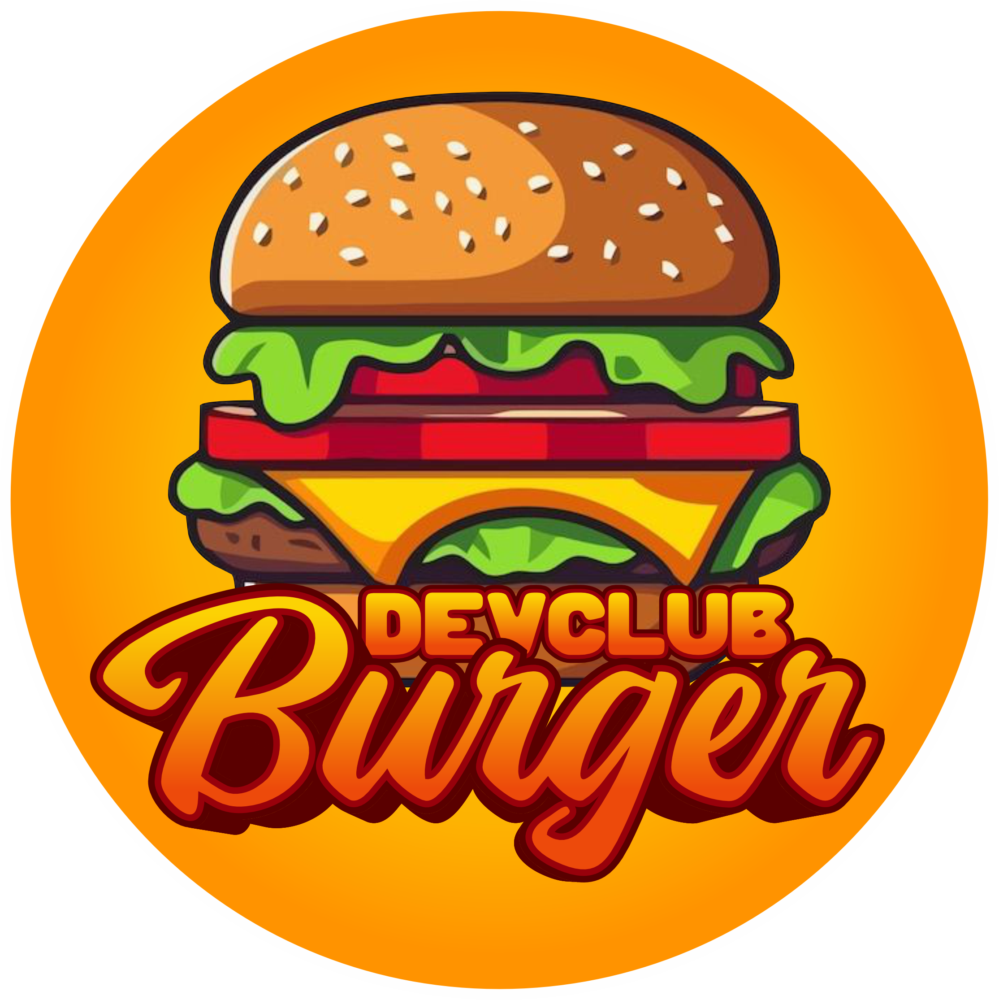
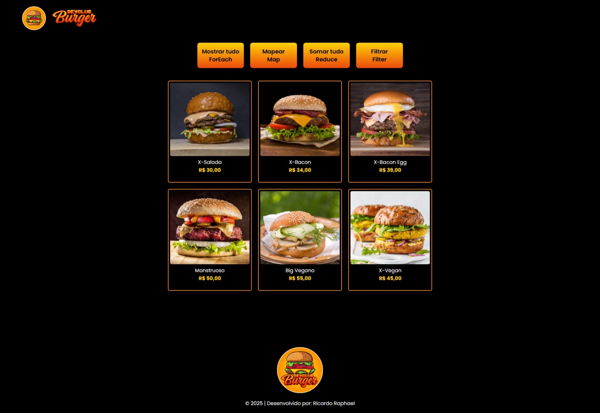
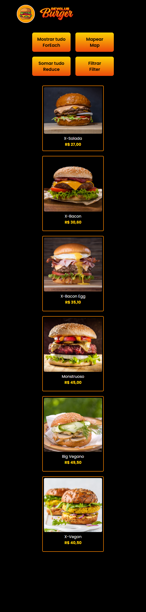

  

<h1 align="center"> 
	🍔​​ DevClub Burger 🍔​
</h1>

	

## 💻 Sobre o projeto

<h3>Projeto: DevClub Burger | Desenvolvido durante a formação full-stack <a href="https://rodolfomori.com.br/devclub-comercial/">DevClub</a> como desafio no módulo de JavaScript A Nova Ordem de Dados</h3>

O objetivo deste projeto foi desenvolver uma aplicação web que exibisse uma lista de opções de produtos de um cardápio, apresentando imagem, nome e preço de cada item.

Durante o desenvolvimento, enfrentei alguns desafios interessantes:

Exibir todos os produtos no navegador utilizando o método .forEach().

Implementar a funcionalidade de calcular e mostrar o desconto de 10% em cada produto, utilizando o método .map() para gerar uma nova lista de produtos com os preços ajustados.

Calcular o valor total dos produtos, tanto com desconto quanto sem desconto, com o método .reduce().

Filtrar e exibir apenas os produtos veganos utilizando o método .filter().

As principais tecnologias utilizadas foram: HTML, CSS e JavaScript, garantindo uma estrutura semântica, um design simples e responsivo, além da lógica aplicada no Front-End.

Resultado: o projeto resultou em uma aplicação funcional e dinâmica, permitindo a interação do usuário com as listas de produtos e oferecendo uma visão clara dos preços e descontos.

---

## 🎨 Imagens do Projeto

### Web

  

### Mobile

  	

---

## 🛠 Tecnologias

<h3>As seguintes tecnologias foram utilizadas no projeto:</h3>

  
  
  
  
  
  

---

## 👨‍💻​ Autor

<b>Ricardo Raphael</b>✨

---

Desenvolvido por Ricardo Raphael 👋🏽 [Entre em contato!](https://www.linkedin.com/in/ricardoapraphael/)

